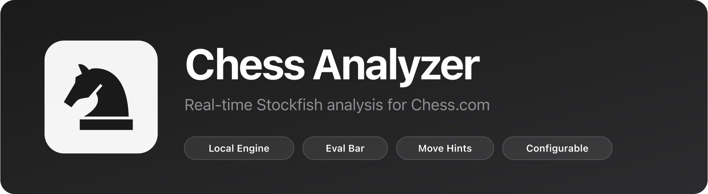

<p align="center">
  
</p>

<p align="center">
  
  
</p>

> **⚠️ DISCLAIMER:** This extension was built purely for **educational purposes** because I was bored and wanted to learn about Chrome extension development, Stockfish integration, and Web Workers. If you actually use this to cheat in real chess games, you're a bum. Seriously, don't be that person. Use it to learn how chess engines work or analyze your own games after they're finished like a normal human being.

## Features

- **Local Stockfish Engine** — Runs entirely in your browser via Web Worker. No external API dependencies.
- **Evaluation Bar** — Vertical eval bar positioned next to the board. Animated, perspective-aware (flips for black).
- **Best Move Hints** — Subtle dot indicators on the board showing the engine's recommended move.
- **Two Dot Modes** — *Inconspicuous* (tiny, color-matched dots that blend into the board) or *Normal* (visible black dots).
- **Independent Controls** — Eval bar and analysis engine can be toggled on/off separately.
- **Configurable Engine** — Adjust search depth, CPU threads, and hash table size from the popup.
- **Your Turn Only** — Move hints only appear when it's your turn to play.
- **Native Detection** — Automatically hides the custom eval bar when Chess.com's built-in evaluation is active.

## Install

> **Hey bum**, before you install this to cheat in your 800 ELO games, remember: this was made as a **coding exercise** while I was bored. It's meant for **learning purposes**, understanding engine evaluation, position analysis, and browser extension architecture. Using it to cheat makes you look pathetic. Analyze your completed games, study positions, or just appreciate the technical implementation. Don't be a loser.

1. Clone or download this repository
2. Open `chrome://extensions/` in Chrome
3. Enable **Developer mode** (top right)
4. Click **Load unpacked** and select this folder
5. Open a game on [chess.com](https://www.chess.com)

## Architecture

```
content.js        — Injected into chess.com. Reads moves, renders eval bar & dot hints.
background.js     — Service worker. Routes messages between content script and engine.
offscreen.js      — Offscreen document. Hosts the Stockfish Web Worker (MV3 requirement).
popup.html/js     — Extension popup. Toggle controls and engine settings.
chess.js           — Chess.js library for move validation and FEN generation.
stockfish-engine.js — Stockfish 10 compiled to JavaScript.
```

**Data flow:**

```
Chess.com move list → content.js extracts moves → chess.js generates FEN
→ background.js routes to offscreen.js → Stockfish Worker analyzes
→ result flows back → content.js updates eval bar + dot hints
```

## Settings

| Setting | Range | Default | Description |
|---------|-------|---------|-------------|
| Depth | 8–24 | 14 | Search depth. Higher = stronger but slower |
| Threads | 1–16 | 1 | CPU cores for the engine |
| Hash | 16–1024 MB | 16 | Memory allocated for position cache |

## Permissions

- `storage` — Save user preferences
- `activeTab` / `tabs` — Communicate with chess.com tabs
- `offscreen` — Run Stockfish Web Worker (MV3 restriction)

## Educational Purpose Statement

This project exists because I was bored and wanted to explore:
- Chrome Manifest V3 architecture and offscreen documents
- Stockfish UCI protocol implementation in JavaScript
- Real-time DOM manipulation and chess board detection
- Web Worker performance optimization

**If you're using this to cheat:** Congrats, you're a bum. You're literally letting a computer play for you while pretending you're good at chess. That's sad. Chess.com has anti-cheat detection, you'll probably get banned, and everyone will know you're a fraud.

**Legitimate uses:** 
- Study the codebase to learn extension development
- Analyze your own completed games
- Understand how chess engines evaluate positions
- Educational research on chess AI

Don't be a bum. Play your own games.

## License

Knight icon from [Game Icons](https://game-icons.net/1x1/skoll/chess-knight.html) — [CC BY 3.0](https://creativecommons.org/licenses/by/3.0/)
